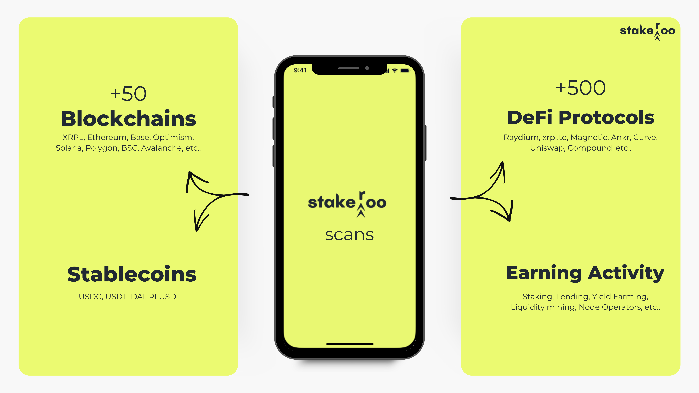

# Stakeroo
AI-optimized stablecoin aggregator designed for non-crypto users &amp; businesses

## Business Plan 
### Confidential 

*Pitchdeck can be found here: https://tinyurl.com/stakeroo-pitchdeck*

*Business plan can be found here: https://tinyurl.com/Stakeroo-businessplan*

---

## Executive Summary

Stakeroo is an AI-powered, non-custodial platform that simplifies blockchain-based passive earnings by acting as an optimized, chain-agnostic stablecoin aggregator. It integrates all core DeFi features like staking, lending, liquidity provision, and yield farming, with exclusive use of stablecoins into a single, one-click, user-friendly experience. Leveraging advanced machine learning algorithms, Stakeroo scans and optimizes over 500 DeFi protocols across more than 8 blockchains, focusing solely on stablecoins to provide steady returns without the volatility common in crypto investments. By prioritizing security, ease of use, and sticking to strict selection criteria, Stakeroo contributes to the mass adoption of DeFi, offering users and businesses access to the safest, highest-yield stablecoin opportunities for consistent earnings.

