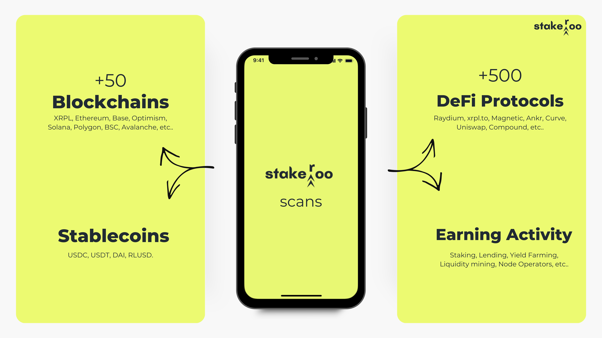

# Stakeroo
AI-optimized stablecoin aggregator designed for non-crypto users &amp; businesses

## Business Plan 
### Confidential 

*Pitchdeck can be found here: https://tinyurl.com/stakeroo-pitchdeck*

*Business plan can be found here: https://tinyurl.com/Stakeroo-businessplan*

---

## Executive Summary

Stakeroo is an AI-powered, non-custodial platform that simplifies blockchain-based passive earnings by acting as an optimized, chain-agnostic stablecoin aggregator. It integrates all core DeFi features like staking, lending, liquidity provision, and yield farming, with exclusive use of stablecoins into a single, one-click, user-friendly experience. Leveraging advanced machine learning algorithms, Stakeroo scans and optimizes over 500 DeFi protocols across more than 8 blockchains, focusing solely on stablecoins to provide steady returns without the volatility common in crypto investments. By prioritizing security, ease of use, and sticking to strict selection criteria, Stakeroo contributes to the mass adoption of DeFi, offering users and businesses access to the safest, highest-yield stablecoin opportunities for consistent earnings.

As a non-custodial aggregator, Stakeroo ensures users retain full control over their assets with real-time blockchain visibility. Tailored for both individuals and businesses, Stakeroo simplifies and optimizes the DeFi experience by unifying fragmented protocols, breaking down complex barriers, offering transparent earnings, and reducing risk.

For businesses, Stakeroo enhances treasury management by securely growing reserves through stablecoin-based strategies, supported by detailed analytics, reporting systems, and compliance tools.

---

### Mission

- Destigmatize the blockchain space by shifting away from “get rich quick” narratives to responsible, sustainable growth.
- Bridge the gap between the real world and blockchain, making it more trustworthy and accessible for new users and businesses.
- Promote financial inclusion and smart investment options for everyone, especially in times of inflation.
- Drive the mass adoption of blockchain by creating a trusted, one source of truth, and an easy-to-use platform for non-trading passive earnings.
- Increase awareness about blockchain as a complex, innovative ecosystem beyond just cryptocurrencies.
- Make crypto investing straightforward, accessible, and manageable for both individuals and businesses

**Mission Statment**

> Our mission is to build trust in blockchain by making DeFi so simple that users will be on the blockchain without even knowing it. We aim to simplify crypto investment and promote smart, inclusive financial practices. We empower users and businesses to achieve sustainable, inflation-resistant growth while showcasing the vast potential of blockchain technology beyond digital currencies.

---

### Vision

Our vision is to be the trusted, single source of truth for secure, non-trading passive blockchain earnings, making blockchain technology accessible and beneficial to everyone. 

We envision a world where smart, stable, and transparent financial growth through blockchain is mainstream, empowering users and businesses alike to benefit from secure, inflation-resistant returns. users and businesses with inflation-resistant returns. 

By building trust and simplifying DeFi, we aim to lead the way in connecting everyday users with the full potential of blockchain beyond trading and speculation.

---

### Unique Selling Proposition (USP)

Stakeroo is the first non-custodial, AI-powered platform that transforms non-trading blockchain-based passive earnings through a simple, secure, and accessible experience. 

- AI-Powered aggregation from +500 DeFi protocols across +50 chains.
- Strict criteria combined with an exclusive focus on the 4 major trusted Establecoins (USDT, USDC, DAI, and RLUSD).
- One-click investment with no need to select currencies.
   Automated Portfolio Rebalancing
- User-centric design with comprehensive educational materials.
- Mobile access to monitor earnings anytime, anywhere.
- Over 500 sign-ups within two weeks.

